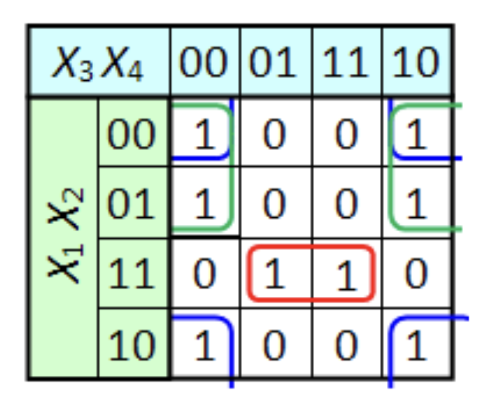

# Схемотехника
## Содержание
- [Введение](#введение)
- [Синтез комбинационных схем](#синтез-комбинационных-схем)
	- [СДНФ/СКНФ](#сднфскнф) 
	- [Карты Карно](#карты-карно)
 		- [Особенности использования](#особенности)
- [Комбинационные схемы](#комбинационные-схемы)
  	- [Кодер/декодер](#кодердекодер)
	- [Мультиплексор/демультиплексор](#мультиплексордемультиплексор) 
- [Последовательностные схемы](#последовательностные-схемы)
  	- [Триггеры](#триггеры)
  		- [Обозначения](#обозначения)
  	  	- [Бистабильная ячейка](#бистабильная-ячейка)
  	  	- [Синхронный RS-триггер](#синхронный-rs-триггер)
  	  	- [JK-триггер](#jk-триггер)
  	  	- [T-триггер](#t-триггер)
  	  	- [D-триггер](#d-триггер)
  	  	- [DV- и TV- триггеры](#dv--и-tv-триггеры)
  	  	- [Триггеры с динамическим управлением](#триггеры-с-динамическим-управлением)
  	- [Регистры и счетчики](#регистры-и-счетчики)
  		- [Счетчики](#счетчики)
  	 		- [Классификация счетчиков](#классификация-счетчиков)
  	  	- [Регистры](#регистры)
  	  		- [Регистры памяти](#регистры-памяти) 
  	  		- [Регистрв сдвига](#регистры-памяти)
- [Аппаратная реализация арифметических операций](#аппаратная-реализация-арифметических-операций)
	- [Комбинационные схемы](#комбинационные-схемы-1)
 		- полусумматор
     		- полный сумматор
       		- многоразрядные сумматоры
         	- полувычитатель
          	-    
	- [Последовательностные схемы](#последовательностные-схемы-1)
- [Дополнительные материалы](#дополнительные-материалы)
## Введение
Существует 2 типа электронных схем:
- **Комбинационные** — состояние выходов зависит от состояния входов в данный момент. Надо учитывать, что у каждого элемента есть время задержки, обусловленное неидеальностью технологии изготовления, температурой.
- **Последовательностные** (схемы с памятью) — характеризуются тем, что их переключение зависит не только от наличия соответствующих управляющих сигналов, но и от их предыдущих состояний. 

## Синтез комбинационных схем

На вход подается таблица истинности, которая затем преобразуется в логическое выражение.

### СДНФ/СКНФ
**СДНФ** — совершенная дизъюнктивная нормальная форма (строится по строкам с 1 в результате, 0 — $\overline x$ , 1 — $x$)
**СКНФ** — совершенная конъюнктивная нормальная форма (строится по строкам с 0 в результате, 0 —  $x$, 1 —  $\overline x$)

Выражения формируются тривиально, но неоптимальны с точки зрения количества логических элементов

**Пример**
Слева от таблицы расположена СДНФ, справа — СКНФ

### Карты Карно
Для функций от небольшого числа переменных можно использовать карты Карно для построения минимальных ДНФ или КНФ

На большой комбинационной схеме можно попробовать выразить одни функции или их части через другие

Итоговая логическая функция реализуется в виде схемы на доступных логических элементах

> [!WARNING]
> Обратите внимание на порядок: 00, 01, 11, 10

Карта Карно закольцована по горизонтали и вертикали:
- После четвертой строки идет первая
- После четвертого столбца идет первый

Компактная ДНФ строится путем объединения true-ячеек в группы
- **Группы** на карте Карно – это прямоугольники, у которых длина стороны – степень двойки (1, 2, 4 клетки) 
- Группы строятся с учетом закольцованности карты 
- Группы могут пересекаться
- Каждая группа должна быть как можно больше 
- Количество групп должно быть как можно меньше

**Минимальная ДНФ**:
- Каждая группа – отдельное слагаемое
- В слагаемое записывается произведение тех переменных, которые имеют одно значение внутри группы
- Инверсии переменных в произведении определяются так же как в СДНФ

**Минимальная КНФ**
Строится аналогично, но в группы входят нули

### Пример
На лекции разбирался пример с семисегментным индикатором

Таблицу истинности заполняем следующим образом:
- 1 ставится, если сегмент задействуется при выводе требуемой цифры
- 0 — если нет

Карта закольцована

**Минимальная ДНФ**

**Минимальная КНФ**

#### Особенности
Часто возникает ситуация, когда некоторые значения таблицы истинности не важны для работы схемы. Тогда им выбирают такие значения, которые обеспечивают максимальный размер групп на карте Карно

Группа может состоять из одного элемента, сторона не может состоять из трех элементов: нужна степень двойки

Минимальных нормальных форм может быть несколько для одной таблицы истинности

## Комбинационные схемы
Порядок как был на лекции, но не в презентации

**АЛУ** — арифметическо-логическое устройство
Арифметика реализуется через логику
### Кодер, мультиплексор, демультиплексор
#### Кодер/декодер
**Кодер, шифратор** (encoder) – преобразование из унарного кода в двоичный. Реализуется через комбинацию логических сложений

**Дешифратор** выполняет функцию обратную шифратору, т.е. служит для преобразования двоичного кода в позиционный. (дешифратор от анг. decoder)

**Унарный код** (позиционный код) — все нули, кроме одного. Номер разряда с 1 определяет число

$m \  = \ 2^{n}$, где n — число разрядов двоичного, m — унарного. Также это соотношение входов и выходов 

> [!WARNING]
> Не следует путать с дешифратором из криптографии (decryptor)

#### Мультиплексор/демультиплексор
**Мультиплексор** – вывод сигналов от разных источников к одному получателю
 - А кодирует номер источника, с которого идет сигнал
 - Реализуется на основе декодера, выходы которого перемножаются с выходами соответствующих источников 
 - Используется для вывода данных из регистров
 - Любую таблицу истинности можно реализовать через мультиплексор с 1 и 0 на источниках
- Обозначается MUX от multiplexor или MS от multiplexor selector.

- $A_{i}$ — адресный вход
$D_{i}$ — информационные входы
F — выход

$m = 2^{n}$, где m — число инф. входов, n — число адресных входов

> [!TIP] 
> На мультиплексоре можно реализовать любую комбинационную схему

**Демультиплексор** – передача сигнала от одного источника разным получателям 
- Реализуется аналогично мультиплексору
- Используется для записи данных в регистры
- Обозначение демультиплексора: DMX или DMS
- A — адресный вход, D — информационный

> [!TIP] 
> Демультиплексор выполняет роль дешифратора, если на информационнном входе подан неизменный уровен 0 или 1

## Последовательностные схемы
**Последовательностные устройства** — цифровые устройства с памятью, сигнал на выходе которых зависит от комбинации входных сигналов и от сигналов, извлеченных из памяти в данный момент.

Базовым элементом всех последовательностных устройств является триггер. 

**Триггер** – ячейка памяти, в которую можно записать 1 бит информации (0 или 1).

В операционном усилителе (аналоговый мир, см. лекцию №2) выход хитро подвязывался 
ко входу. В цифре можно делать также

### Триггеры
**Триггер** – последовательностное устройство, которое может находиться в одном из двух устойчивых состояний. Переход из одного устойчивого состояния в другое происходит под действием входных сигналов. Такой переход также называют переключением или опрокидыванием.
#### Классификация триггеров
1. **По функциональному признаку**
	- RS-триггеры
	- D-триггеры
	- T-триггеры
	- JK-триггеры
2. **По способу управления**
	- асинхронные — переключение из одного состояния в другое происходит с поступлением входного сигнала на информационный вход
	- синхронные (тактируемые) — дополнительно к информационному триггер имеет тактовый вход (для подачи тактовых (синхронизирующих) импульсов); переключение триггера осуществляется только при подаче тактирующего (синхронимпульса) импульса.

#### Обозначения
- R — информационный вход, от английского reset
- S — информационный вход, от английского set
- Q — выход (прямой), от английского quit
- $\overline Q$ — инверсный выход
- $Q^{n}$ — предыдущее состояние (до подачи сигналов R, S)
- $Q^{n+1}$ —последующее состояние (после подачи сигналов R, S)
- X — безразличное состояние
- C или CLK — вход тактового сигнала (синхросигнала), сокращенно от английского CLocK (тактировать)
- J — информационный вход, от английского jump
- K — информационный вход, от английского keep
- V — запрещающий сигнал, от немецкого Verbot (запрет)
#### Бистабильная ячейка
- Схема из двух стрелок Пирса или штрихов Шеффера, выходы которых перекрестно соединены с входами
- Может хранить 1 бит информации
- На основе бистабильных ячеек строятся триггеры `flip-flop` — устройства с двумя выходами (один — инверсия второго), позволяющие хранить 1 бит информации
- Сама по себе бистабильная ячейка может рассматриваться как асинхронный RS-триггер
- Состояние 11 запрещено (как деление на ноль). На самом же деле значение будет, но оба выхода окажутся равны (противоречит утверждению, что один инверсия второго)

#### Синхронный RS-триггер
RS-триггер, или триггер с установочными входами, получил свое название по обозначениям входов. Подключением на вход S напряжения уровня логической единицы устанавливается выход Q в состояние логической единицы. (Установить логическую единицу на выход Q означает записать в триггер логическую единицу). Подача логической единицы на вход R позволяет сбрасывать выход Q в нулевое состояние.

- **Однотактный RS-триггер** 
	Переключается между состояниями по тактовому сигналу

	

- **Двухтактный RS-триггер**
	Двухтактная структура позволяет строить схемы, в которых можно не только хранить предыдущее состояние, но и инвертировать его

	
	

#### JK-триггер
Универсальный триггер, при входных сигналах 11 (запретных для RS-триггера) инвертирует свое предыдущее значение. На его основе могут быть построены другие типы триггеров. 

#### T-триггер
JK-триггер, у которого на оба входа подается один сигнал

Также известен как счетный триггер, осуществляет деление частоты на 2, т.е. на каждые два тактовых импульса на выходе выдает один импульс. Счетным он называется потому, что на выходе Q T-триггера логический ноль сменяется единицей и наоборот при последовательном поступлении импульсов на его вход Т. Поэтому можно сказать, что этот триггер умеет считать только от нуля до одного.

- В таблице истинности остаются только первая и последняя строчки (хранение и инверсия)
- Если синхросигнал колеблется с заданной частотой, то выход будет колебаться с вдвое меньшей
- Если соединить T-триггеры в цепочку (Q предыдущего подается на T следующего), каждый следующий будет колебаться с вдвое меньшей частотой — получится счетчик импульсов

#### D-триггер
JK- или RS-триггер, у которого инверсия первого входа подается на второй

D-триггер имеет специальный информационный вход. Другие названия: триггер задержки, фиксатор или прозрачная защелка.

- В таблице истинности остаются только вторая и третья строчки (0 и 1)
- Обеспечивает задержку сигнала на 1 такт
- Если соединить в цепочку D-триггеры (Q предыдущего подается на D следующего), то на каждом такте значение предыдущего триггера будет переходить на следующий – получится сдвиговый регистр

#### DV- и TV-триггеры
Устаревшие варианты D- и T-триггеров, в которых есть дополнительный сигнал V (Verbot), запрещающий/разрешающий переключение состояний (как бы дополнительный синхросигнал). 

%%Уточнить, что значит перечеркнутый вход. Вроде как обозначить И, схема совпадения%%

#### Триггеры с динамическим управлением
Триггеры с динамическим управлением переключаются при изменении уровня синхросигнала
### Регистры и счетчики
#### Счетчики
**Счетчик импульсов** – функциональный узел для подсчёта импульсов, поданных на его вход. счётчики строятся на триггерах.

**Информационная емкость** - коэффициент счёта ($K_{cч}$) – это число в двоичном коде, до которого можно производить счёт (максимальное значение.) $K_{cч} = 2^{n}$, где n – число триггеров. Если $K_{cч} \neq 2^{n}$, то счётчик имеет произвольный коэффициент счёта.

##### Классификация счетчиков
**По принципу действия**: 
1. асинхронные (последовательные) – каждый последующий триггер срабатывает от предыдущего, а сигналы счёта подаются на первый триггер.
2. синхронные – тактовый сигнал подается сразу на все разряды, но срабатывание последующего триггера происходит после того, как единицами заполнены все младшие разряды.

**По способу обработки информации**:
1. прямого счёта – каждый последующий импульс прибавляет «1» к имеющейся информации в счётчике (счёт на увеличение, счёт на сложение). 
2. обратного счёта – с каждым тактовым импульсом от информации в счётчике вычитается «1» (счёт на вычитание).
3. реверсивные – считают как в прямом (на сложение), так и в обратном (на вычитание) направлении
#### Регистры
**Регистр** – последовательностное устройство, предназначенное для приема, хранения, передачи и преобразования информации.

> [!INFO] 
> Регистры строятся на D-триггерах. (Можно на RS и JK, но на D легче)

Регистр может выполнять следующие операции: 
- установка регистра в исходное состояние (сброс – запись нулевого кода);
- запись двоичного слова в регистр (в последовательной и/или параллельной форме);
- хранение информации; 
- сдвиг хранимой информации влево или вправо; 
- преобразование хранимой информации из последовательной формы в параллельную и наоборот;
- поразрядные логические операции. 

Различают регистры памяти и регистры сдвига.

**Регистры памяти** предназначены для временного хранения информации (данных). 
**Регистры сдвига (сдвиговые регистры)** предназначены как для временного хранения информации, так и для ее сдвига в сторону младших разрядов (вправо), так и в сторону старших разрядов (влево) без изменения информации. Кроме того, регистры сдвига могут преобразовывать информацию из параллельной формы в последовательную и наоборот. 
##### Регистры памяти 
Массив триггеров для хранения многоразрядных данных

**Назначение**: используются в микропроцессорных системах при работе на общую нагрузку (шина адреса, шина данных)
	

##### Регистры сдвига
**Параллельный код (форма)** – информация (двоичное число), появляющаяся на всех разрядах регистра одновременно.

**Последовательный код (форма)** – информация (двоичное число), появляющаяся на одном разряде регистра последовательно с каждым тактовым импульсом

Преобразуют последовательный код в параллельный и/или наоборот • Варианты: • Цепочка D-триггеров (Q предыдущего подается на D следующего) • Цепочка JK/RS-триггеров (Q предыдущего подается на J/S следующего, а not(Q) – на K/R)

Варианты:
- Цепочка D-триггеров (Q предыдущего подается на D следующего)
- Цепочка JK/RS-триггеров (Q предыдущего подается на J/S следующего, а not(Q) – на K/R)

  
  

**Типы регистров**
- Параллельный ввод, последовательный вывод
- Последовательный ввод, последоватедльный вывод
- Последовательный ввод, параллельный вывод
- Параллельный ввод, параллельный вывод

## Аппаратная реализация арифметических операций
### Комбинационные схемы
Сумматоры – комбинационные устройства, выполняющие функцию сложения чисел.
#### Полусумматор 
Осуществляет сложение двух **одноразрядных** чисел

$C_{out}$ — перенос из младшего разряда (то самое «один в уме»). Образовано от английского carry (перенос) и out (выход)

УГО полусумматора

**УГО** — условно-графическое обозначение

#### Полный сумматор
Осуществляет сложение двух **одноразрядных** чисел с учетом **переноса** из младшего разряда

> [!NOTE] 
> Полный сумматор, в отличие от полусумматора, учитывает результат предыдущего сложения и для этого имеет вход переноса из предыдущего разряда.

$C_{in}$ — перенос из младшего разряда, от английского carry

#### Многоразрядные сумматоры
На базе одноразрядного полного сумматора строятся многоразрядные сумматоры.
Также известны как параллельные
 $С = (A + B) \ mod \ 2^{n} \text{, где n — число разрядов}$

#### Полувычитатель
%% Уточнить: Вычитатели строятся на базе сумматоров и в виде отдельных устройств не предусмотрены. Для выполнения операции вычитания на сумматоре необходимо вычитаемое представить в обратном коде, и к результату прибавить 1.%%

#### Полный вычитатель

#### Многоразрядный вычитатель с переводом в обратный код

#### Универсальный сумматор-вычитатель

### Последовательностные схемы
#### Последовательный сумматор
- При каждом такте на вход поступает очередной двоичный разряд (от младших разрядов к старшим)
- На выходе на каждом такте значение соответствующего разряда суммы • Триггер используется для переноса 1 в старший разряд («1 в уме»)

По сравнению с параллельным сумматором (комбинационной схемой):
- Требуется меньше логических элементов
- Может использоваться для суммирования чисел с произвольным числом разрядов
- Операция занимает много времени (на каждый разряд требуется один такт)

#### Умножители

##### Табличные
**Преимущества**: высокая скорость
**Недостатки**: применим только для чисел небольшой разрядности

Иногда является хорошим решением для аппаратных схем

ROM условно называется памятью, по факту может быть комбинационная схема
##### Многократного сложения
**Преимущества**: простота схемной реализации
**Недостатки**: медленная скорость выполнения операций

**РМ** — регистр множимого
**Сч** — счетчик
**РМн** — регистр множителя

##### Сложения и сдвиги
Умножение «столбиком»
Применяется в современных процессорах
##### Модульные
«Очень хитрая схема»(с)
«Реализуемо, но жестко и сложно»(с)

Метод основан на использовании представления числа в виде степенного ряда

Операция уммирования и умножения на степень числа 2 осуществляется специальным параллельным сумматором, который также может быть реализован в виде комбинационной схемы

Модульное умножение может быть осуществлено над числами в параллельном коде и над числами в последовательном коде

**Преимущество**: высокая скорость
**Недостаток**: существенная сложность

Применяется при проектировании ASIC (интегральная схема, специализированная для решения конкретной задачи)

___
## Дополнительные материалы
- [Презентация](лекция_03_СХЕМОТЕХНИКА.pdf)
- [Комбинационные схемы](07_Electronics_22_Combin_Logic_2016.pdf)
- [Последовательностные схема](014_DD_LECTURE_Sequential_Logic_2020.pdf)
- [Учебник](Базовые элементы цифровой техники.pdf)
